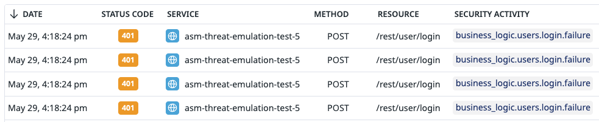
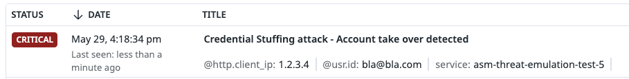
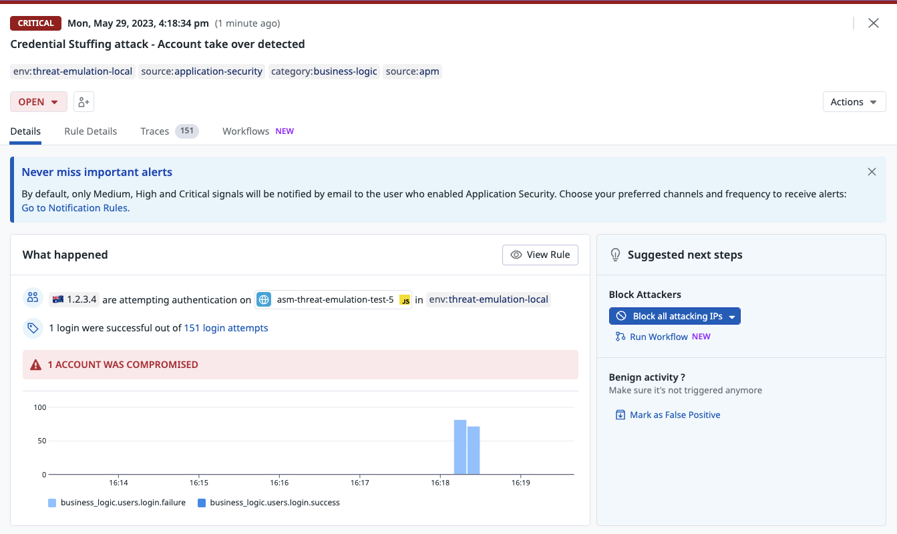

# Credential Stuffing

## Overview
Credential Stuffing attacks are a very popular attack against authentication systems. The threat actors attempts to gain unauthorized access to accounts by using lists of compromised credentials.

## Run the attack
You can run the attacks using our cli tool

```shell
docker run --rm -t --network asm-threat-emulation-network asm/threat-cli run -a 7
```

This command will run the cli inside the docker container. The CLI will launch attacks from this [file](./../cli/attacks/generic-payloads.txt) on the vulnerable application.

```shell
Running attack #7:  Credential Stuffing attack
Target URL:  http://juiceshop:3000
✔ Credential Stuffing attack - done
```

## Result
After launching this attack, you will be able to find the traces in Datadog ASM explorer and a Credential Stuffing signal will be generated.

### Login Traces
You can review the login traces by navigating to [ASM trace](https://app.datadoghq.com/security/appsec/traces?query=%40appsec.security_activity%3Abusiness_logic.users.login.%2A%20)




### Credential Stuffing Signal
A Credential Stuffing signal will be generated with severity low. If a succesful account takeover happen such as in our case, the signal's severity is upgraded to critical. You can review the security signals by navigating to [ASM trace](https://app.datadoghq.com/security?query=%40workflow.rule.type%3A%22Application%20Security%22&column=time&order=desc&product=appsec&view=signal)



