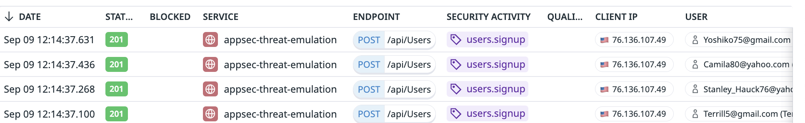
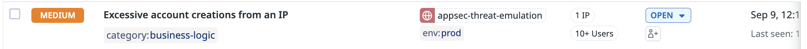

# Excessive signups

## Overview

This attack demonstrates the ability to use business logic tags to alert on suspicious activity. In this case, if the number of `users.signup` events from the same IP is reported beyond a threshold prescribed by a detection rule, that rule will fire a signal.

## Run the attack

You can run the attacks using our cli tool. The attack will create several new user records in the application.

```shell
docker run --rm -t --network appsec-threat-emulation-network asm/threat-cli run -a 11
```

The attack  will 

```shell
Running attack #11:  Multiple signups
Target URL:  http://juiceshop:3000
✔ User signups: 11 accounts created
```

## Result

After launching this attack, you will be able to find the traces in the traces explorer which report that a "Business logic event" called `users.signup` "from SDK library" was detected.  An `Excessive account creations from an IP` signal will be generated.

### Login Traces

You can review the login traces by navigating to [Investigate > Traces](https://app.datadoghq.com/security/appsec/traces?query=%40appsec.security_activity%3Abusiness_logic.users.signup)




### Excessive account creations from an IP

An "Excessive account creations from an IP" signal will be generated with MEDIUM severity. 


