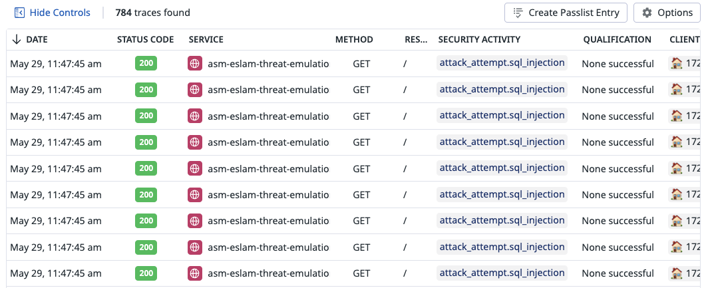
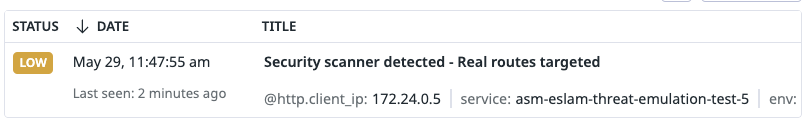
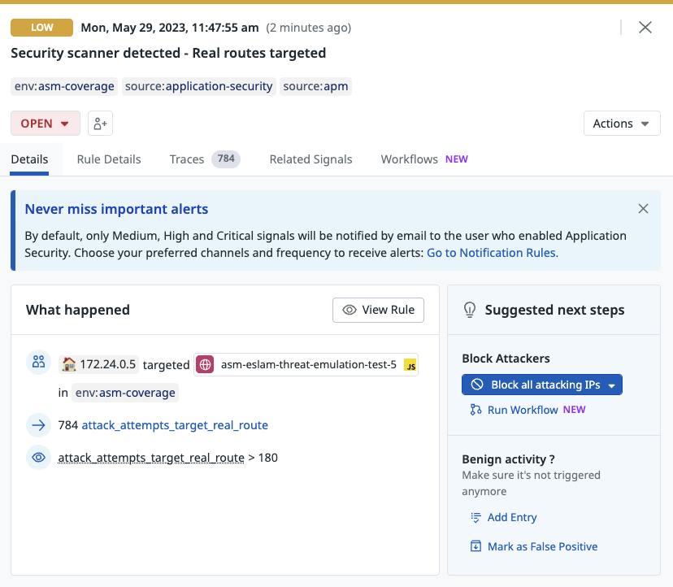

# Generic security scanning

## Overview
Security scanning is one of the first major steps in any hackers methdology to find vulnerabilities in your systems. It works by sending a lot of attack payloads at the target hoping something triggers.

## Run the attack
You can run the scan using our cli tool

```shell
docker run --rm -t --network asm-threat-emulation-network asm/threat-cli run -a 2
```

This command will run the CLI inside the docker container. The CLI will launch attacks from this [file](./../cli/attacks/fuzzing.txt) on the vulnerable application.

```shell
Running attack #1:  Generic security scan
Target URL:  http://juiceshop:3000
✔ Basic security scan - done
```

## Result
After launching this attack, you will be able to find the traces in Datadog ASM explorer and a security scanner signal will be generated

### Security Traces
You can review the security traces by navigating to [ASM trace](https://app.datadoghq.com/security/appsec/traces)




### Security Scanner Signal
A security scanner signal will be generated with severity low. You can review the security signals by navigating to [ASM trace](https://app.datadoghq.com/security?query=%40workflow.rule.type%3A%22Application%20Security%22&column=time&order=desc&product=appsec&view=signal)



