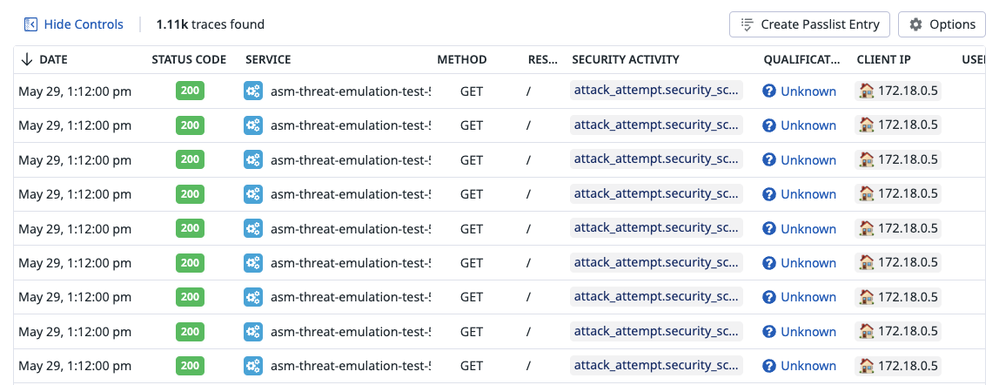
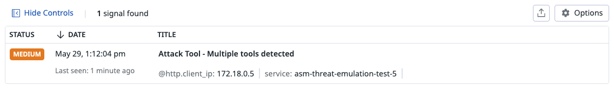
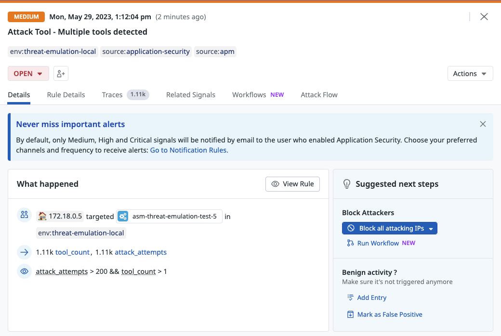

# Attack with a known security tools

## overview
This attack is simulating attacking with known security tools


## Run the attack
You can run the attacks using our cli tool

```shell
docker run --rm -t --network asm-threat-emulation-network asm/threat-cli run -a 2
```

This command will run the cli inside the docker container. and the CLI will launch some attacks from this [file](./../cli/attacks/generic-payloads.txt) with personation of known security tools

```shell
Running attack #2:  Security scan using known attack tools
Target URL:  http://juiceshop:3000
✔ Basic security scan - done
```


## Result
After launching this attack, you should be able to see the traces in Datadog ASM explorer and a attack tools signal will be generated


### Security Traces
You can view the security traces by navigating to [ASM trace](https://app.datadoghq.com/security/appsec/traces)





### Security Scanner Signal
A security scanner signal will be generated with severity low. You can view the security signals by navigating to [ASM trace](https://app.datadoghq.com/security?query=%40workflow.rule.type%3A%22Application%20Security%22&column=time&order=desc&product=appsec&view=signal)



