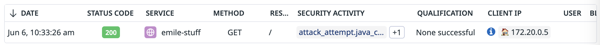
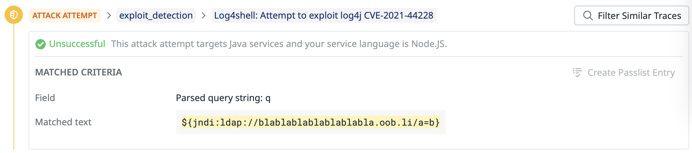
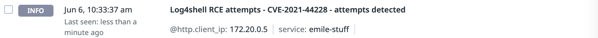

# Log4shell attack on Node.js application

## Overview
Exploits against popular libraries are often attempted on a large scale, even against applications that can't possibly be vulnerable. This results in noise that still needs to be triaged by responder.

In our exemple, we have the case of log4shell exploits sent to Node.js applications. Since log4shell exploit the log4j library which is only available for Java applications, there is no way for our application to be vulnerable. ASM is able to make the connexion and tag the trace an "No attack succesful" and only generates an `INFO` signal when the exploit isn't relevant. 

## Run the attack
You can run the scan using our cli tool

```shell
docker run --rm -t --network appsec-threat-emulation-network asm/threat-cli run -a 3
```

This command will run the CLI inside the docker container. The CLI will launch an attack using a log4shell payload on the vulnerable application.

```shell
Running attack #3:  Log4Shell attack on a a Non-Vulnerable application
Target URL:  http://juiceshop:3000
✔ Log4Shell attack on a Non-Vulnerable application - done
```

## Result
After launching this attack, you will be able to find the traces in Datadog ASM explorer and a security scanner signal will be generated.

### Security Traces
You can review the security traces by navigating to [ASM trace](https://app.datadoghq.com/security/appsec/traces)





### Security Scanner Signal
A security scanner signal will be generated with severity Info. You can review the security signals by navigating to [ASM Signals](https://app.datadoghq.com/security?query=%40workflow.rule.type%3A%22Application%20Security%22&column=time&order=desc&product=appsec&view=signal)



