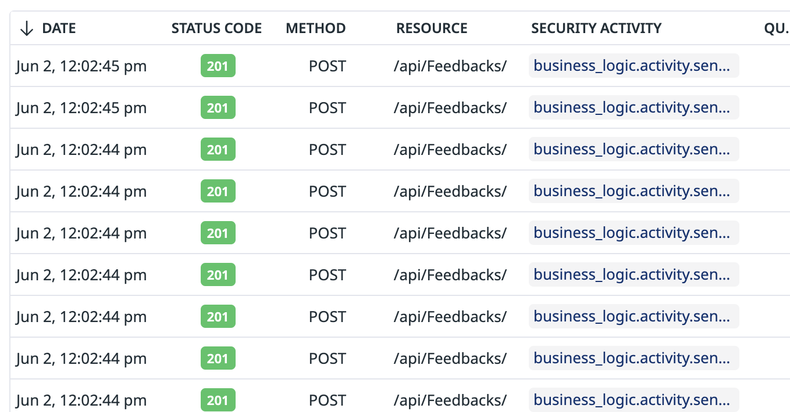
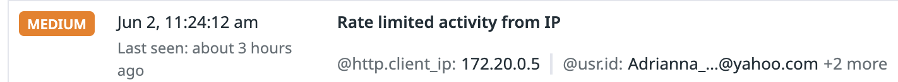

# Rate limiting

## Overview
Many user activities incur costs of various natures, and needs to be throttled. In this scenario, an attacker tries to send spam comments.

## Run the attack
Unlike our other signals, this one isn't enabled by default. You will need to [turn it on in this page](https://app.datadoghq.com/security/configuration/asm/rules?query=type%3Aapplication_security%20Rate%20limited%20activity%20from%20&deprecated=hide&groupBy=none&product=appsec&sort=rule_name).

This rule also require the application to be instrumented [as described here](https://docs.datadoghq.com/security/application_security/threats/add-user-info/?tab=custombusinesslogic). The test application we're using has already been instrumented for this purpose.

Once the signal is enabled, you can run the attacks using our cli tool

```shell
docker run --rm -t --network asm-threat-emulation-network asm/threat-cli run -a 8
```

This command will run the cli inside the docker container. The CLI will send 200 spam comments to the vulnerable application.

```shell
Running attack #8:  Spam campaign
Target URL:  http://juiceshop:3000
✔ Sending spam: 200 spam messages sent
```

## Result
After launching this attack, you will be able to find the traces in Datadog ASM explorer and a Rate limiting signal will be generated.

### Login Traces
You can review the login traces by navigating to [ASM trace](https://app.datadoghq.com/security/appsec/traces?query=%40appsec.security_activity%3Abusiness_logic.activity.sensitive&start=1685623216493&end=1685709616493&paused=false)



### Rate limit Signal
A Rate Limit Exceeded signal will be generated with severity medium. . You can review the security signals by navigating to [ASM Signals](https://app.datadoghq.com/security?query=%40workflow.rule.type%3A%22Application%20Security%22%20%40workflow.rule.name%3A%22Rate%20limited%20activity%20from%20IP%22%20&column=time&order=desc&product=appsec&view=signal&start=1685623323776&end=1685709723776&paused=false)


