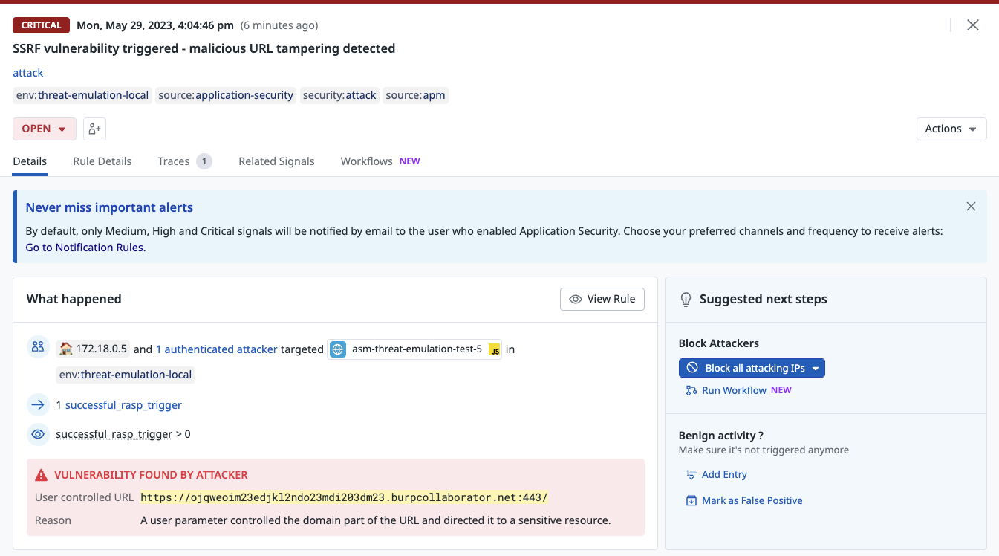

# Server Side Request Forgery (SSRF) attack

## Overview
This attack is simulating a SSRF attack in two scenarios. 
The first scenario is [an attack on a non-vulnerable endpoint](#1-ssrf-attacks-on-a-non-vulnerable-endpoint) while the second one is [a successful exploit on a vulnerable endpoint](#2-ssrf-attacks-on-a-vulnerable-endpoint).


```
├────┼────────────────────────────────────────────────────────────┤
│ 6  │ SSRF attacks on a Non-Vulnerable endpoint                  │
├────┼────────────────────────────────────────────────────────────┤
│ 7  │ Successful SSRF attack on a Vulnerable endpoint            │
├────┼────────────────────────────────────────────────────────────┤
```


## 1. SSRF attacks on a Non-Vulnerable endpoint

```shell
docker run --rm -t --network asm-threat-emulation-network asm/threat-cli run -a 6
```

This command will run the CLI inside the docker container. The CLI will launch attacks from this [file](./../cli/attacks/ssrf-payloads.txt) on a non-vulnerable endpoint.
Unlike with SQL, this endpoint doesn't perform network queries and thus can't be vulnerable to SSRF.


```shell
Running attack #6:  SSRF attacks on a Non-Vulnerable endpoint
Target URL:  http://juiceshop:3000
✔ Basic SSRF injection attack - done
```

### Result
After launching this attack, you will be able to find the traces in Datadog ASM explorer but no signal will be generated.

### Security Traces
You can review the security traces by navigating to [ASM trace](https://app.datadoghq.com/security/appsec/traces)


### SSRF Attack Signal

As you can see, every trace were qualified as "none successful" since ASM detected that the server attempted no outgoing http connection in response to this request. This is a clear indication that the SSRF attack was unsuccessful.

Beacuse of that ASM knows not to generate a signal and not divert your attention from more pressing signals.

## 2. SSRF attacks on a Vulnerable endpoint

```shell
docker run --rm -t --network asm-threat-emulation-network asm/threat-cli run -a 7
```

This time the attack will execute a working exploit on a vulnerable endpoint. This simulates a successful exploitation of a real vulnerability.

```shell
Running attack #7:  Successful SSRF attack on a Vulnerable endpoint
Target URL:  http://juiceshop:3000
✔ Successful SQL injection attack - done
```

### Result
After launching this attack, you will be able to find the traces in Datadog ASM explorer and a SSRF vulnerability signal will be generated. This time the trace is qualified as `harmful` and the signal severity is `critical` because this is an active vulnerability and is being exploited.

### Security Traces
You can review the security traces by navigating to [ASM trace](https://app.datadoghq.com/security/appsec/traces)


The traces here are qualified as `harmful` because ASM detected that this SSRF is exploited successfully


### SSRF Vulnerability Triggered Signal
A SSRF signal will be generated with severity critical. You can review the security signals by navigating to [ASM signals](https://app.datadoghq.com/security?query=%40workflow.rule.type%3A%22Application%20Security%22&column=time&order=desc&product=appsec&view=signal)


