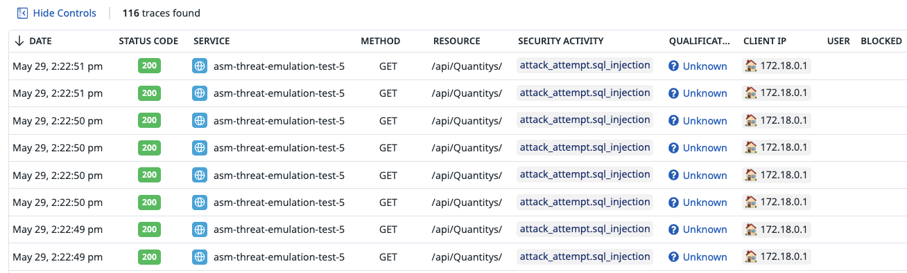
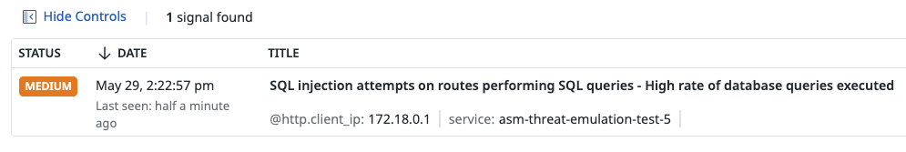
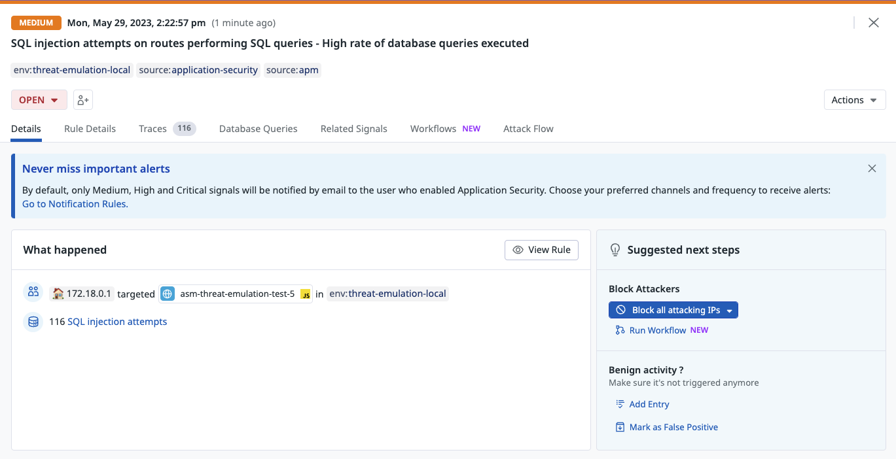
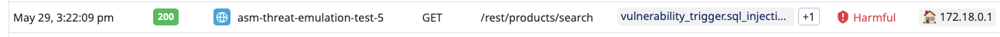
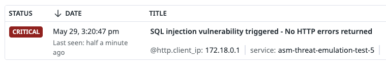
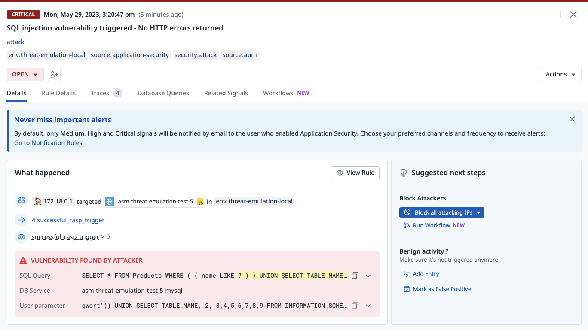

# SQL Injection attack

## overview
This attack is simulating a SQL injection attack in two scenarios. 
The first scenario is [an attack on a non-vulnerable endpoint](#sql-injection-attacks-on-a-non-vulnerable-endpoint) while the second one is [a successful exploit on a vulnerable endpoint](#sql-injection-attacks-on-a-vulnerable-endpoint).


## Run the attack
You can run the attacks using our cli tool


```
├────┼────────────────────────────────────────────────────────────┤
│ 3  │ SQL injection attacks on a a Non-Vulnerable endpoint       │
├────┼────────────────────────────────────────────────────────────┤
│ 4  │ Successful SQL injection attack on a a Vulnerable endpoint │
├────┼────────────────────────────────────────────────────────────┤
```

### 1. SQL injection attacks on a Non-Vulnerable endpoint

```shell
docker run --rm -t --network asm-threat-emulation-network asm/threat-cli run -a 3
```

This command will run the cli inside the docker container. and the CLI will launch some attacks from this [file](./../cli/attacks/sqli-payloads.txt) on a non-vulnerable endpoint


```shell
Running attack #3:  SQL injection attacks on a a Non-Vulnerable endpoint
Target URL:  http://juiceshop:3000
✔ Basic SQL injection attack - done
```


### Result
After launching this attack, you should be able to see the traces in Datadog ASM explorer and a attack tools signal will be generated.


### Security Traces
You can view the security traces by navigating to [ASM trace](https://app.datadoghq.com/security/appsec/traces)





### SQL Injection Attack Signal
A SQL injection signal will be generated with severity medium. You can view the security signals by navigating to [ASM trace](https://app.datadoghq.com/security?query=%40workflow.rule.type%3A%22Application%20Security%22&column=time&order=desc&product=appsec&view=signal)






### 2. SQL injection attacks on a Vulnerable endpoint

```shell
docker run --rm -t --network asm-threat-emulation-network asm/threat-cli run -a 4
```

This time the attack will execute a working exploit on a vulnerable endpoint. So this is simulate a successful exploitation of a vulnerability


```shell
Running attack #4:  Successful SQL injection attack on a a Vulnerable endpoint
Target URL:  http://juiceshop:3000
✔ Successful SQL injection attack - done
```


### Result
After launching this attack, you should be able to see the traces in Datadog ASM explorer and a attack tools signal will be generated. This time the traces is highlighted as `harmful` and the signal severity is `critical` because this is an active vulnerability and its getting exploited.


### Security Traces
You can view the security traces by navigating to [ASM trace](https://app.datadoghq.com/security/appsec/traces)





### SQL Injection Attack Signal
A SQL injection signal will be generated with severity medium. You can view the security signals by navigating to [ASM trace](https://app.datadoghq.com/security?query=%40workflow.rule.type%3A%22Application%20Security%22&column=time&order=desc&product=appsec&view=signal)



